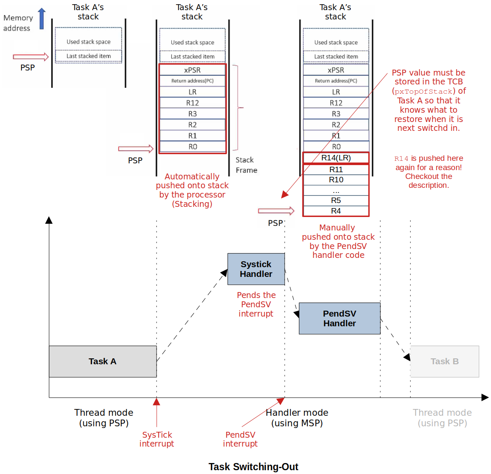

# Bare-Metal RTOS
This repository contains the source code for the **Bare-Metal RTOS** development project. Visit the "Bare-Metal RTOS" section on my website for more details: https://jackklee.com/portfolio/bare-metal-rtos.

## Introduction

Developed a real‐time operating system (RTOS) on the bare‐metal STM32F407‐Discovery board

### 1. RTOS using STM32CubeIDE

* Source code:  [./STM32CubeIDE](./STM32CubeIDE)
* Used **STM32CubeIDE** for software development

### 2. RTOS without using IDE (Bare-Metal)

* Source code: [./bare-metal](./bare-metal)
* Used **Vim** editor for software development, **GNU Arm Embedded Toolchain** for cross‐compiling, and **OpenOCD** with **GDB** client to load and debug the project on the target board

## Objective

- Understand and be able to implement a scheduler, one of the core part of the OS,  from scratch.
- Be able to set up incremental build system using Make utility.
- Be able to choose, install and use appropriate Cross-Compiler Toolchain.
- Be able to compile a C program for an embedded target without using an IDE.
- Be able to write a microcontroller startup file for STM32F MCU.
- Understand the different sections of the relocatable object file (i.e., `.o` files).
- Be able to write a linker script file from scratch.
- Be able to load the final executable on the target using OpenOCD and GDB client.

## Demonstration

Click the following link to see the test application for the 'Bare-Metal RTOS' project in action: [https://www.youtube.com/embed/MYxrrz4UWkc](https://www.youtube.com/embed/MYxrrz4UWkc)

- Scheduling Algorithm: Round-Robin 
- 4 tasks blinking each LED at a defined frequency:
  - Green: 1000 ms 
  - Orange: 500 ms 
  - Blue: 250 ms
  - Red: 125 ms

## Development Environment

* OS - Ubuntu 22.04.1 LTS (Kernel version: 5.15.0-52-generic)
* Tool Chain - GNU Arm Embedded Toolchain
* Debugger - OpenOCD, GDB client

## Important Concepts

### Scheduling

* An algorithm which makes the decision of preempting a running task from the CPU and makes the decision about which task to dispatch (i.e., allocate CPU) next
* The decision could be based on many factors such as system load, the priority of tasks, share resource access, or a simple Round-Robin method.

### Context (Status) of a Task

* The following diagram shows the core registers of the ARM Cortex-M4 processor.
* Context (Status) of a Task = [General purpose registers] + [Some special purpose registers] + [Status register]
  * These are the important information that need to be stored and retrieved during the "context switching".

### Context Switching

* The procedure of switching out the currently running task from the CPU after saving the task's execution context or state and switching in the next task's to run on the CPU by retrieving the past execution context or state of the task.

