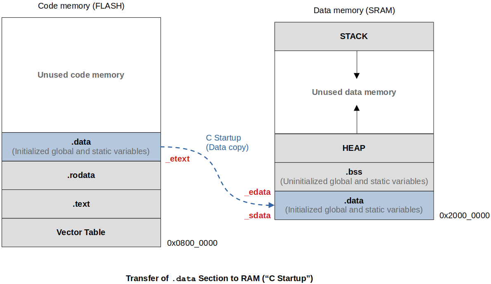

# Lessons Learned

## Cross-Toolchain Important Binaries

* Compiler + linker + assembler: `arm-none-eabi-gcc`
* Assember: `arm-none-eabi-as`
* Linker: `arm-none-eabi-ld`
* Format converter: `arm-none-eabi-objcopy` (Changes one executable format to another)
* ELF file analyzer
  * `arm-none-eabi-objdump`
  * `arm-none-eabi-readelf`
  * `arm-none-eabi-nm`

## Startup File

* A **startup file** is responsible for setting up the proper environment for the main user code to run.
* Code written in startup file runs before `main()` and `main()` gets called by the startup code.
* Some part of the startup file is target (i.e., processor) dependent. (e.g., Vector table, initializing the stack, turning on/off the processor-specific peripherals such as FPU, etc.)
* Startup code takes care of the vector table placement in code memory as required by the ARM Cortex-M processor.
* Startup code may also take care stack reinitialization. (You can alter the stack placement.)
* Startup code is responsible for `.data` and `.bss` sections initialization in main memory. It needs to properly copy the `.data` section from FLASH to SRAM, and properly initialize the `.bss` section to SRAM.
* Only after the initial environment is properly setup, the startup code can call the `main()`.

* Also see [https://kyungjae.dev/embedded-systems-programming-arm/startup-file](https://kyungjae.dev/embedded-systems-programming-arm/startup-file).

## Different Data of a Program & Different Sections of Memory

* Summary

  | Variable (Data)             | LOAD Time (LMA) | RUN Time (VMA) | Section | Remarks                                                      |
  | --------------------------- | --------------- | -------------- | ------- | ------------------------------------------------------------ |
  | Global initialized          | Flash           | RAM            | .data   | Copied from Flash to RAM by startup code                     |
  | Global uninitialized        | -               | RAM            | .bss    | Startup code reserves space for this data in RAM and initializes to 0 |
  | Global static initialized   | Flash           | RAM            | .data   | Copied from Flash to RAM by startup code                     |
  | Global static uninitialized | -               | RAM            | .bss    | Startup code reserves space for this data in RAM and initializes to 0 |
  | Local initialized           | -               | RAM (Stack)    | -       | Allocated at run-time                                        |
  | Local uninitialized         | -               | RAM (Stack)    | -       | Allocated at run-time                                        |
  | Local static initialized    | Flash           | RAM            | .data   | Copied from Flash to RAM by startup code                     |
  | Local static uninitialized  | -               | RAM            | .bss    | Startup code reserves space for this data in RAM and initializes to 0 |
  | All global const            | Flash           | -              | .rodata | Stays in Flash only                                          |
  | All local const             | -               | RAM (Stack)    | -       | Allocated at run-time (Treated as locals)                    |

  > `.data` section is associated with two different addresses; LMA (Load Memory Address), VMA (Virtual Memory Address). LMA is the address when the `.data` section is still on the FLASH, and VMA is the address when it is copied to the RAM (a.k.a. run-time address). 
  >
  > In microcontroller, nothing is virtual. Everything is physical. So, do not regard VMA as the "Virtual memory" generated by the Memory Management Unit (MMU). 
  >
  > **Global const** data do not need to consume RAM since they won't get updated during the run-time. So, no VMA or run-time address. 
  >
  > Lifetime of **local static** variables is the duration of the program. Hence, they do not utilize stack!

* Transfer of `.data` section from Flash to RAM.

* Also see [https://kyungjae.dev/embedded-systems-programming-arm/different-sections-of-a-program](https://kyungjae.dev/embedded-systems-programming-arm/different-sections-of-a-program).
